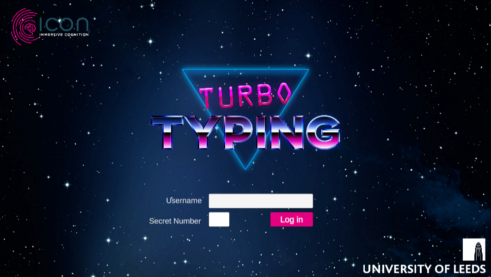

[← Back to home](../index.qmd)

**Research Assistant, University of Leeds (2022–2024)** · [Project page at CAER](https://caer.org.uk/projects/turbo-typing/)

## The project

Turbo Typing was a research project run through the Centre for Applied Education Research (CAER) at the University of Leeds. It delivered a bespoke online touch-typing course to primary school children (aged 9-10) over six months, while recording fine-grained measures of typing ability and its component sub-skills, such as manual dexterity and rollover rate. The aim was to map how these sub-skills developed, and the extent to which they contributed to overall performance at each stage of learning. Alongside its theoretical aims, the project assessed the feasibility of studying sensorimotor learning at scale in naturalistic educational settings. Funding was provided by the Leverhulme Trust.

## My role

I worked as a Unity developer on the Turbo Typing course, responsible for:

- **Task Logic** — coded the task behaviour, ensuring each design decision reflected the underlying psychological theory
- **UI Design** — building the visual elements of the task to keep children engaged and informed throughout the course
- **Data Capture** — ensuring keystroke-level events were logged reliably and with accuracte timings for later analysis

## Tools

Unity · C# · Git  

