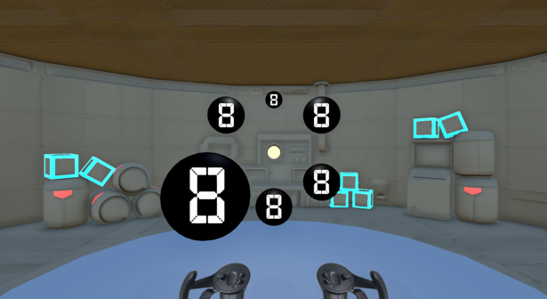

[← Back to home](../index.qmd)

**PhD Project, University of Hull (2025)** · [Read the thesis](https://hull-repository.worktribe.com/output/5462270)

## Summary

Immersive virtual reality is increasingly used in psychology as a way to run controlled experiments in naturalistic settings. My thesis asked whether immersion itself changes how people behave, and if so, whether those changes simply reflected an artefact of the medium, or represented a more accurate measuring of real-world behaviour.

Across a series of experiments, I compared performance on visual attention tasks in immersive VR with matched non-immersive desktop conditions. I manipulated both *global* immersivity (properties of the environment as a whole) and *local* immersivity (properties of the specific task stimuli), and found that immersion did change behaviour: effects that are well established in the desktop literature were attenuated, and in some cases reversed or absent, under immersive conditions.

## Key contributions

- Created a large behavioural dataset from over seven experiments
- Demonstrated how various visual attention paradigms could be implemented in immersive virtual reality
- Identified local immersivity manipulations as the most relevant for behavioural change
- Contributed relevant discussion towards the use of VR as a tool in experimental psychology

## Methods & tools

Unity · C# · Valve Index · R · Python

